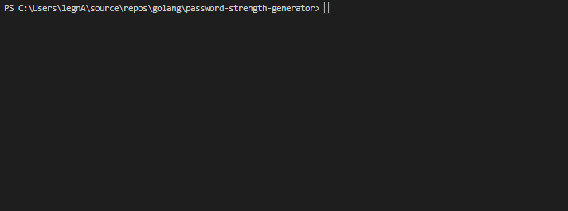

# Password strength generator
----------------------------
## Description
Can be used to generate a quick password or input properties to generate a custom password.
Password will be printed on console along with it's entropy.

## Credits

[wagslane](https://github.com/wagslane/go-password-validator)
Used for get password entropy.

[akilans](https://github.com/akilans/golang-mini-projects)
Inspired by golang mini projects. 

## Demo
